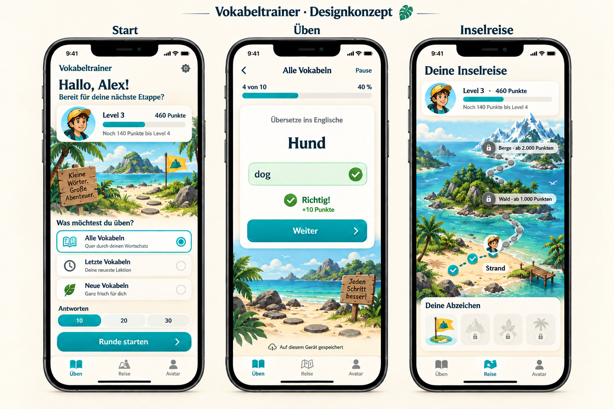

# Visuelles Konzept: Insel-Abenteuer

Auf Nutzerwunsch am 17.09.2026 erzeugte Gestaltungsvorschau, **kein Screenshot einer implementierten Oberfläche und noch keine visuelle Abnahme**. Die vollständige Entwicklung bleibt beauftragt; spätere iPhone-/iPad-Prüfungen bleiben offen.

Gezeigt werden drei zusammengehörige Ansichten: Start mit den drei Modi und Rundengröße; übersichtliche Übung mit Richtig-Rückmeldung; Inselreise mit Strand, Wald und Bergen. Sandfarben, Türkis, große Schaltflächen und ein Entdecker-Avatar konkretisieren das bestätigte Inselthema für 10–13-Jährige. Das Beispielprofil ist erfunden.

Verbindlich bleiben die [Anforderungen](../ANFORDERUNGEN.md) und der [Gesamtentwurf](../superpowers/specs/2026-09-16-vokabeltrainer-design.md). Das Bild ist eine Stilreferenz, kein pixelgenauer Layout- oder Funktionsvertrag. Die spätere Umsetzung muss mit offener Tastatur, größerer Schrift und kleinen Displays funktionieren; Dekoration darf Hauptaktionen nicht verdrängen. „Letzte Vokabeln“ meint die zuletzt angelegte zugeordnete Lektion. Farben, Schrift, Illustrationen und Avatar können auf Nutzerfeedback angepasst werden.

Erzeugung: integrierte Bildgenerierung, anschließend eine gezielte Textkorrektur. Das ursprüngliche Bild wurde nicht überschrieben. Keine fremden Markenfiguren oder externen Bildvorlagen verwendet. Dieses Konzeptbild wird nicht als ausführbare App oder als geprüfte Geräteansicht bezeichnet.
