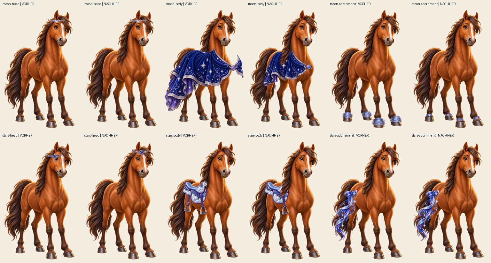
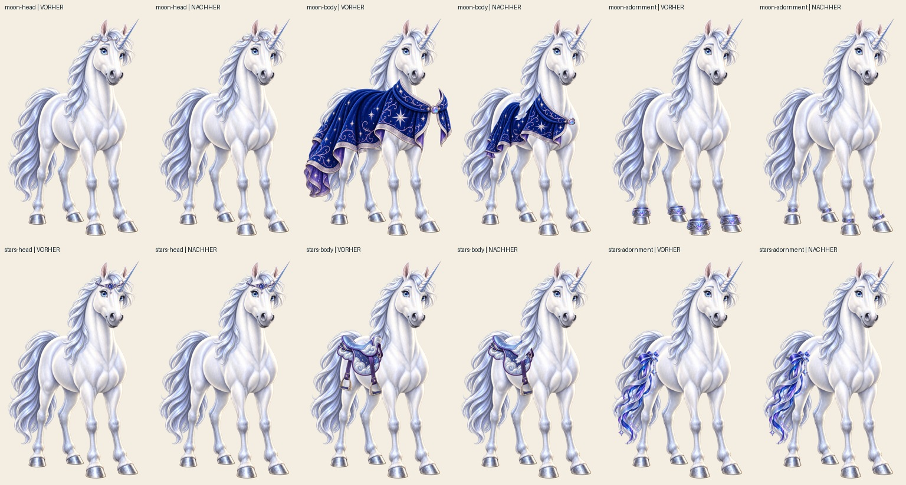
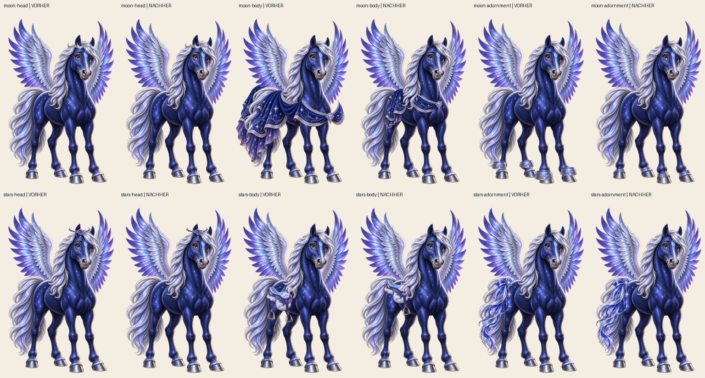

# Körperbezogene Nacharbeit: Pferd, Einhorn und Pegasus

Stand: 20.09.2026. Klassische Bildbearbeitung ist ausdrücklich freigegeben. Diese interne Sichtprüfung ist keine persönliche Nutzerabnahme. Ausgangspunkt aller Originalquellen ist Commit `24ce5a38b561c6012d7307603fc378ca339ab58c`.

## Geändert

- Silberne Hufreifen: vier unabhängige Positionen, Breiten und Winkel je Figur. Dunkle Innenbecher und hintere Ringbögen entfernt; erhalten bleiben schmale gravierte Vorderbänder. Keine kopierten Haut-/Fellpixel.
- Sternenumhänge: körperbezogene Netzverformung erhält gemalte Falten und Säume, verkürzt den Überhang und verbindet die Schließe mit der Brust. Der abstehende ferne Kragenzipfel entfällt. Vordergründige Mähnen verdecken den Stoff örtlich. Drei alte hintere Stofflagen entfallen vollständig, weil sie eine zweite unverbundene Drapierung erzeugten.
- Wolkensättel: ferner Steigbügel ausgeblendet, Mähne örtlich vor die Sattelkante gelegt. Der Pegasus-Sattel liegt höher auf dem Rücken. Der sichtbare Steigbügel und der illustrierte Sattel bleiben erhalten.
- Pferde-Stirnzier: Nach unabhängigem Hinweis höher und zur Stirnmitte verschoben, damit der hängende Stern das sichtbare Auge freilässt.
- Grundfiguren, Punkte, Freischaltungen und Produktdaten wurden nicht verändert.

## Sichtmatrix aller 18 kompatiblen Paare

Die folgenden Vergleichsbögen zeigen jede Karte in 256 Pixeln Breite, links vorher und rechts nachher. Zusätzlich wurden die kritischen Einzelbilder auf der vollständigen 1024 × 1536 Leinwand geöffnet.

| Artikel | Pferd | Mond-Einhorn | Sternen-Pegasus |
| --- | --- | --- | --- |
| Mondsichel-Kopfschmuck | Stirnposition erhalten | Horn/Augen frei, Position erhalten | Stirnposition erhalten |
| Sternenumhang | Drapierung, Schließe, Mähne korrigiert | Überhang, Schließe, Mähne korrigiert | Drapierung unter Flügelansatz, Mähne korrigiert |
| Silberne Hufreifen | Vier Vorderbänder einzeln angepasst | Vier Vorderbänder einzeln angepasst | Vier Vorderbänder einzeln angepasst |
| Sternbild-Kopfschmuck | Höher zur Stirnmitte verschoben | Horn/Augen frei, Position erhalten | Stirnposition erhalten |
| Wolkensattel | Ferner Bügel und Mähnenverdeckung korrigiert | Ferner Bügel und Mähnenverdeckung korrigiert | Sitzhöhe, ferner Bügel und Mähnenverdeckung korrigiert |
| Kometenschweif | Schweifansatz erhalten | Schweifansatz erhalten | Schweifansatz erhalten |

Unveränderte Kopfschmuck- und Schweifquellen wurden mit angesehen. Ihre Position wurde erhalten, weil in diesen Kompositionen keine vergleichbare schwebende Befestigung oder abgeschnittene Sichtkante auffiel. Das ist ein internes Sichturteil und kein Ersatz für die unabhängige Gesamtprüfung oder eine persönliche Abnahme. Die Sättel bleiben bewusst vereinfachte Fantasy-Ausrüstung; sie bilden kein vollständiges Reitgeschirr ab.

## Reproduktion und Grenzen

[Bearbeitungswerkzeug](../../scripts/avatar-fit/equines.py): `python scripts/avatar-fit/equines.py`, Entwicklungsvoraussetzungen Pillow und NumPy. Es liest die festgelegten Originalbytes aus Git, schreibt zehn korrigierte Quellen und ihre Provenienz-Sidecars und entfernt genau die drei benannten alten hinteren Umhangquellen. Es erzeugt außerdem die Vergleichsbögen. Das Werkzeug gehört nicht zur Laufzeit-App.

Jeder Sidecar enthält Originaldateien und SHA-256-Werte, Zielcanvas, Identitätsregistrierung und die konkreten Anker, Masken oder Netzpunkte. Die eigentliche WebP-Ableitung erfolgt anschließend gemeinsam über `node scripts/build-avatar-art.mjs`. Build, Browserregression und unabhängige Sichtprüfung werden im Gesamtbericht separat nachgewiesen.
