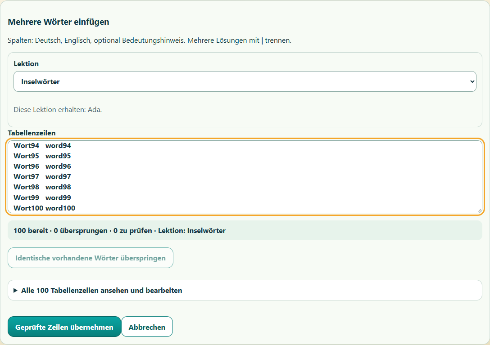

# Einfachere und schnellere Vokabeleingabe

Stand: 29.09.2026. **Abgeschlossen und privat bereitgestellt; anschließend Pause.**
Ausgangspunkt: `5ff5aef8e919472b1e5a8a2fefff977cb4535b29`.

## Auftrag und Umfang

Der Nutzer möchte Einzeleingabe, Sammelübernahme und Lektions-/Kinderzuordnung
vereinfachen. Vorrang haben viele Wörter aus Excel oder einer anderen Tabelle.
Nach dem konkreten Vorschlag „Einfügen → automatische kompakte Prüfung →
gemeinsam übernehmen“ beauftragt er die Fortsetzung mit Superpowers und
Subagent-Driven Development. Dieser begrenzte Ablauf ist umgesetzt; die
Prüfungen und die private Bereitstellung werden unten getrennt nachgewiesen.

Die bestehenden tabgetrennten Spalten Deutsch, Englisch und optional Hinweis
bleiben erhalten, ebenso mehrere Lösungen mit `|`. Ein direkter Excel-Dateiimport,
OCR, neue Dienste und Änderungen am Konto-/Kostenmodell gehören nicht dazu.

## Änderung

- Die Prüfung beginnt direkt nach dem Einfügen, ohne zusätzlichen Vorschauklick.
  Eine kurze Übersicht nennt bereite, übersprungene und noch zu prüfende Zeilen
  sowie die Ziellektion. Fehler sind direkt bearbeitbar; normale Zeilen liegen
  in einer aufklappbaren Gesamtansicht.
- Exakt gleiche vorhandene Wörter können bewusst gesammelt übersprungen werden.
  Abweichende Bedeutungen bleiben einzeln prüfbar. Quell- und Zieländerungen
  aktualisieren die Prüfung.
- Lektion und Kinder werden im selben Ablauf festgelegt. Vorhandene Zuordnungen
  sind sichtbar; eine neue Lektion wird gemeinsam mit ihren Wörtern gespeichert.
- **Speichern und nächstes Wort** behält die Lektion und fokussiert das nächste
  deutsche Wort. Bestehende Wörter werden weiterhin als derselbe Eintrag bearbeitet.
- `commands.importWords` übernimmt den geprüften Stapel in einer Queue-Operation,
  einer Arbeitskopie und einer atomaren lokalen Speicherung. Neue Wörter erhalten
  gewöhnliche v2-Revisionen, Lern-IDs und Outbox-Einträge. Datenformate,
  Lernhistorie, Punkte, Kaufkern und Cloudprotokoll bleiben erhalten.
- Datensatz, Epoche, Ziellektion, aktuelle Duplikate und Feldgrenzen werden vor
  dem Schreiben geprüft. Identische vollständig abgeschlossene Wiederholungen
  mit denselben IDs schreiben nichts; Teilwiederholungen und abweichende Inhalte
  werden zurückgewiesen. Spätere Lektionsänderungen werden nicht überschrieben.
- Die Erfolgsmeldung bezeichnet das lokale Speichern. Der reguläre
  Google-Abgleich folgt getrennt und wird weiterhin im Verbindungsstatus angezeigt.

Cache v37 ersetzt v36; es kommt kein Laufzeitmodul hinzu.

## Gemessene Verbesserung

Reale Import-/Commandfunktionen mit derselben synthetischen Fixture und
Memory-Store, Windows, Node v26.10.0; Migration vor dem Messfenster.
Je ein Lauf, Ausgangsbestand drei Wörter und fünf Ereignisse. Die Messung
enthält keine Browserdarstellung, IndexedDB- oder Google-Zeit.

| Neue Wörter | Übernahme vorher | Übernahme nachher | Speicherungen vorher → nachher |
| ---: | ---: | ---: | ---: |
| 10 | 40,086 ms | 9,795 ms | 10 → 1 |
| 100 | 928,259 ms | 28,418 ms | 100 → 1 |
| 250 | 6.313,467 ms | 73,233 ms | 250 → 1 |

Parsen und Zeilenprüfung liegen separat je Lauf bei etwa 0,3–1,5 ms.
Inhalte, Anzahl, eindeutige IDs, Lektionsbindung, Outbox und Erhalt des
Ausgangsbestands sind geprüft. Jede neue Übernahme löst genau eine Speicherung
und eine Änderungsmeldung aus. Das ist ein synthetischer Vergleich, keine
zugesicherte Wartezeit auf einem Telefon oder mit einem großen echten Bestand.

## Prüfung und Review

Die neuen Command- und Browserfälle wurden vor der Umsetzung mit passendem
Fehler beobachtet und anschließend erfolgreich. Die gezielte Browserprüfung
umfasst 100 eingefügte Wörter auf 320/390 Pixeln, Doppelklickschutz, Korrekturen,
Zielwechsel, Duplikatentscheidungen, nächste Einzeleingabe, Entwurferhalt,
Speicherfehler und Wiederholung. Vorhandene Offline-/Updatefälle gehören dazu.
Desktop und schmale Ansichten wurden zusätzlich visuell geprüft.

Die unabhängige Prüfung fand zwei zusammengehörige Entwurfsgrenzen:
Äußere Navigation während einer Speicherung konnte einen neuen Entwurf erlauben,
der durch den späteren Abschluss des alten Auftrags entfernt wurde. Außerdem
umgingen normale Lektionsaktionen die Nachfrage bei ungespeichertem Import.
Beide Fälle sowie der Weg über einen bereits geöffneten Entwurfsdialog wurden
im synthetischen Browser reproduziert und korrigiert. Sechs zusätzliche
Speicher-/Dialogfälle und ein Lektionsfall prüfen Erfolg, Speicherfehler und
bewusstes Verwerfen. Die abschließende relevante Browserauswahl ist
**22/22 PASS**, ohne übersprungene Fälle, nach allen UI-Korrekturen.

Zwei vollständige Node-Läufe ergaben zunächst jeweils 649/650 PASS mit
unterschiedlichen Zeitfehlern im unveränderten Kaufbereich. Der erste
betroffene Fall bestand isoliert in 2,840 Sekunden und im zweiten Gesamtlauf;
der zweite betroffene Fall hatte im ersten Lauf bestanden. Windows protokolliert
während dieser Läufe Modern-Standby-Intervalle von 13:05:25–13:11:25,
13:16:41–13:18:49 und 13:20:27–13:28:24 (Europe/Berlin), passend zu den
ungewöhnlichen Laufzeitunterbrechungen. Die ersten beiden entstanden durch
Inaktivität, der dritte durch Schließen des Deckels. Die Fehlversuche bleiben
als solche dokumentiert; Kaufcode und Testfristen wurden nicht geändert.

Für den abschließenden Lauf hält ein nur während des Testprozesses gültiger
[Windows-Aufruf](https://learn.microsoft.com/en-us/windows/win32/api/winbase/nf-winbase-setthreadexecutionstate)
das System wach und setzt den vorherigen Zustand anschließend zurück.
Das ändert keine dauerhaften Energieeinstellungen und verhindert kein bewusstes
Zuklappen. Der abschließende vollständige Lauf nach allen Produktkorrekturen
bestand mit **650/650 PASS**, Exit 0, 261.933,121 ms; kein übersprungener oder
abgebrochener Fall. Beide zuvor betroffenen Kauftests bestanden. Der Helfer
beendete den vorübergehenden Wachzustand am 29.09.2026 um 13:47:56 Uhr.
Die unabhängige Gegenprüfung schließt die Entwurfsbefunde mit Spec/Qualität PASS.
Produktcommit: `c866bd76e98b9fcf4673a7d7a567674c282d04aa`. Der isolierte
Arbeitsbaum ist nach dem Commit sauber. Auch die unabhängige breite
Abschlussprüfung gibt genau diesen Commit mit Spec/Qualität PASS frei;
es gibt keine offenen Reviewbefunde.

Tatsächlich ausgeführter vollständiger Test: `npm.cmd test`.
Die Browserauswahl wurde mit `node --test --experimental-test-isolation=none`
über `vocabulary-entry.browser.mjs`, `overhaul.browser.mjs`,
`trainer.browser.mjs`, `status-feedback.browser.mjs` und
`evolution-art.browser.mjs` ausgeführt; die gezielte Namensauswahl umfasst
Import, Einzeleingabe, Entwurfsgrenzen, Offline-Start, kontrolliertes Update und
Bildcache. Für die Browserprüfung müssen `PLAYWRIGHT_MODULE` und bei Bedarf
`BROWSER_EXECUTABLE` auf die vorhandene lokale Installation zeigen.

Die vollständigen lokalen Rohprotokolle heißen im Testausgabeverzeichnis
`test-results/vocabulary-entry/` insbesondere `final-node-awake.log` und
`final-browser-after-review.log`. Die vorangegangenen Fehlversuche stehen in
`final-node.log` und `final-node-second.log`; die zugehörigen RED-/GREEN- und
gezielten Diagnoseprotokolle sind dort ebenfalls erhalten. Die beschriebenen
gezielten Prüfungen ersetzen keine vollständige physische Geräteabnahme.

## Bereitstellung und Grenzen

Der Produktcommit `c866bd76e98b9fcf4673a7d7a567674c282d04aa` ist per
Fast-Forward in `codex/vokabeltrainer-v1` integriert und nach dem Push mit
dem tatsächlichen GitHub-Branchkopf exakt verglichen. Diese Abschlussdokumentation
wird anschließend auf demselben Zweig gesichert.

199 freigegebene Dateien wurden für die private Bereitstellung vorbereitet;
fünf Laufzeitdateien änderten sich. Worker-Version
`84f65e5f-5871-4cb4-847c-08b4aaec97c7` ist seit
29.09.2026, 11:53:58.477 UTC zu 100 Prozent aktiv. Um 11:54:45.471 UTC
wurden neun ausgelieferte Dateien bytegleich mit dem geprüften Paket verglichen:
Trainer-HTML, SW v37, CSS, Konfiguration, Hauptmodul, Commands, Erwachsenen-
und Vokabelansicht sowie Importmodul. Der lesende Abruf verwendet den vorhandenen
Windows-Zertifikatsspeicher bei aktiver Zertifikatsprüfung.

Im vorhandenen Codex-Testbrowser erschien nach Neuladen das Updateangebot.
**Jetzt aktualisieren** wurde übernommen; danach war das Angebot verschwunden.
40 verfügbare Punkte, 2.040 Lernpunkte, Level 11 und ausgewählte Drachenstufe 4
blieben im DOM erhalten. Der kurz beim Laden sichtbare Google-Hinweis verschwand
nach Wiederaufnahme ohne neue Anmeldung; nach dem Update erschien er nicht.
Die Erwachsenenansicht wurde nicht erneut mit PIN geöffnet: Die neue Eingabe
ist durch synthetische Browserfälle, sichtbare Aufnahmen und ausgelieferte
Dateiidentität belegt, nicht durch eine neue echte Wortübernahme in diesem
Drive-Testbereich. Familien-Chrome blieb unberührt.

Natürlicher Google-Tokenablauf bleibt offen. Beim vorangegangenen Einstieg in
denselben Testbrowser waren Profil, 2.040 Lernpunkte, Level 11, 40 verfügbare
Punkte und ausgewählte Drachenstufe 4 erhalten, ohne erneuten Galeriehinweis.
Die gezielte Sitzungsstatusseite wurde durch den Browserclient blockiert;
ein vorbereiteter Metadatenhelfer wurde nicht ausgeführt. Daraus wird kein
Nachweis einer natürlichen Token-Erneuerung abgeleitet.

Physische iPhone-/iPad-/Safari-/Zweitgeräteabnahmen, die reale Zeit einer großen
Tabellenübernahme sowie weitere Kaufbeschleunigung bleiben getrennte Aufgaben.
Es wurden keine Familienbestände ersetzt oder neue Konten eingerichtet.

Der Nutzer verlangt nach diesem Schritt ausdrücklich Pause. Nach Sicherung
von Dokumentation und Übergabe keine neue Produktarbeit, Bereitstellung,
Bilderzeugung oder Testsitzung ohne ausdrückliche Fortsetzung beginnen.
[Pausenübergabe](../handoffs/2026-09-29-vokabeleingabe.md).

## Arbeitsentscheidungen

- Der Fortsetzungsauftrag nach dem konkreten Vorschlag gilt für die begrenzte
  Überarbeitung des vorhandenen Kopier-/Einfügewegs. Ein zusätzlicher Dateiimport
  wäre gesonderter Folgeumfang, falls der Nutzer ihn ebenfalls benötigt.
- Die natürliche Google-Erneuerung bleibt ausdrücklich ungeprüft. Der blockierte
  Statusaufruf wurde nicht umgangen und der vorbereitete Metadatenhelfer nicht
  ausgeführt; dieser praktische Nachweis bleibt deshalb offen.
- Wegen der Agentenbegrenzung wurden vorhandene abgeschlossene Agenten mit
  eigenen, vollständigen Briefings wiederverwendet. Implementierung, Taskreview
  und breite Abschlussprüfung blieben personell getrennt. Möglichen alten
  Kontext begrenzen die klaren Briefings und unabhängigen Gegenprüfungen.
- Ein vollständig gleicher bereits abgeschlossener Import darf ohne erneutes
  Schreiben Erfolg melden, obwohl die Lektion inzwischen umbenannt oder anders
  zugeordnet wurde. Datensatz, Epoche, verwendbare Lektion und alle Wortinhalte
  müssen passen. Das schützt spätere Bearbeitungen; eine falsche Gleichheitsprüfung
  würde eine irreführende Wiederholungsmeldung verursachen, weshalb sie gezielt
  getestet wurde.
- Integration, GitHub-Sicherung und private Bereitstellung setzen den bereits
  autorisierten Projektablauf fort. Sichtbarkeit, Anbieter und Berechtigungen
  ändern sich dadurch nicht. Ein unerwünschtes Appupdate wäre über die
  protokollierten Versionen rückgängig zu machen.
- Die unabhängige Taskprüfung begann am eingefrorenen Diff parallel zum langen
  Node-Lauf. Die breite Prüfung las danach zunächst die stabilen Kernmodule,
  während die UI-Korrektur lief. Die geänderten Teile wurden anschließend
  gesondert nachgeprüft; Freigabe setzt endgültigen Commit und erfolgreiche
  Testgates voraus. Dieses Überlappen spart Wartezeit, benötigt bei Änderungen
  aber den dokumentierten erneuten Abgleich.
